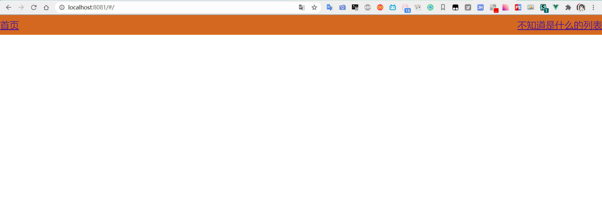
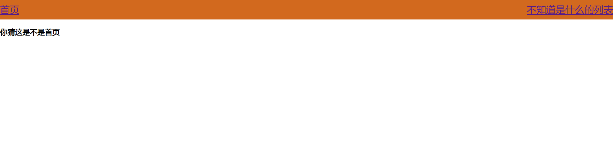
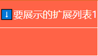
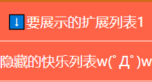
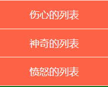
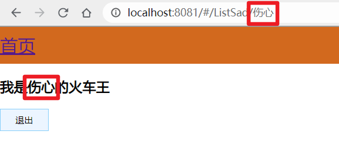
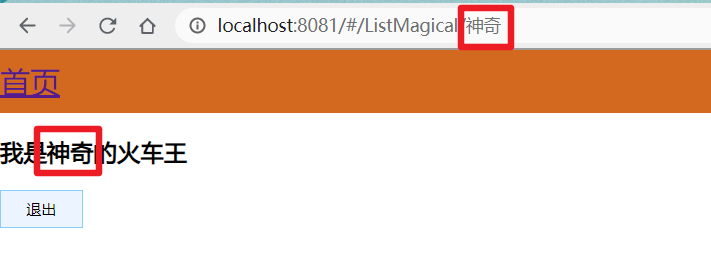
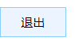

# vue-router自定义案例

## CSS

```css
#app {

 margin: 0;

 padding: 0*px*;

 height: 100*%*;

}

/* 头部 */
.header {

 height: 50*px*;

 background-color: chocolate;

 line-height: 50*px*;

 text-align: center;

 font-size: 24*px*;

 color: #fff;

}

/* 主体 */
.main {

 display: flex;

 position: absolute;

 top: 50*px*;

 bottom: 40*px*;

 width: 100*%*;

}

/* 左侧a标签 */
#_linkleft {

 float: left;

}

/* 右侧a标签 */
#_linkright {

 float: right;

}

/* 内容 */
.content {

 flex: 1;

 text-align: center;

 height: 100*%*;

}

/* 侧边栏 */
.left {

 flex: 0 0 20*%*;

 background-color: darkgreen;

}

/* 侧边栏 a标签 */
.left a {

 display: block;

 height: 100*%*;

 color: white;

 text-decoration: none;

}

/* 按钮 */
button {

 height: 30*px*;

 background-color: #ecf5ff;

 border: 1*px* solid lightskyblue;

 font-size: 12*px*;

 padding: 0 20*px*;

}

```

## 页面自己搞吧

## 需求

### 1.手动配置路由(懂得都懂)

### 2.启动后状态



### 3.重定向路由

(启动自动加载首页路由)



### 4.嵌套路由

点击要展示的扩展列表1



显示隐藏列表



隐藏列表为子路由

### 5.命名路由 / 路由传参

当点击扩展列表2中的列表时 会跳转到新的路由,

并且将 状态 传给路由中的文字

#### 要求:

 三种方式传值对应三个列表项

 还有每项列表需要有个名字

点击列表



展示页面






### 6.编程式导航 - 返回键(不用多说了吧)

