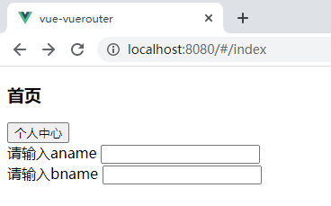
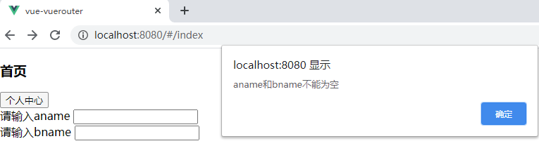
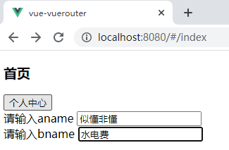
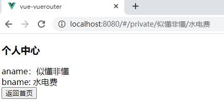
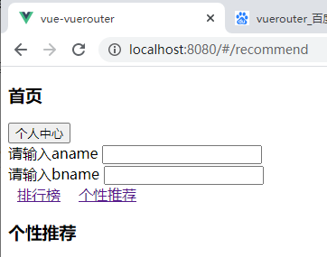
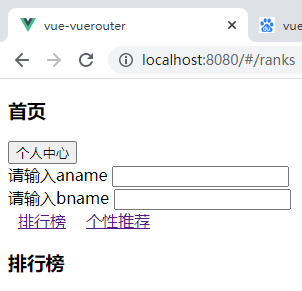

1. 创建vue项目（不勾选router选项）

2. 下载vue-router

3. 自己配置routes/index.js 文件

   （配置时需要给“/private”路由命名）

4. 创建Index.vue和Private.vue组件

5. 当访问"/" 或者 “/index” 时显示：

   

6. 当点击“个人中心时”

   

   保证输入框中有内容

   

   然后跳转到个人中心页

   （要求：使用编程式导航俩种实现方式，router-link俩种实现方式）

   

7. 点击个人中心的返回首页按钮，返回首页

   （要求：能想到俩种实现方法）

8. 为首页添加俩个子路由（嵌套路由）

   

   

   点击排行榜链接，显示排行榜组件，点击个性推荐链接，显示个性推荐

   要求：

   1. router-link的 `to=""` 和 `:to=""` 俩种方式都要用上（俩个子路由各用一种），
   2.  要实现懒加载的方式加载这俩个组件