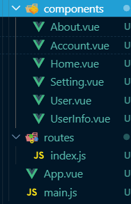

## vue-router 综合基础内容的案例

1. 首先通过【vue create vue-router-text】创建好文件夹，在选择中不可以选中router，其余按照之前的创建的方法自主创建

2. 第二步，首先配置好一个简单的路由，组件设置为【Home.vue 、User.vue】内容随机；根组件为App.vue。

3. 第三步，设置好路由的重定向在home组件，解释重定向的所用和如何使用

4. 第四步，将之前设置的路由方式改变，直接在component中导入的方式除了要重定向的那个。

5. 第五步，设置嵌套路由，创建子组件【About.vue】中的子组件为【Setting.vue、Account.vue】，并且每次进行重定向后的页面直接指向setting

6. 第六步，在【Account.vue】中给定了数据，自主渲染

7. 第七步，当点击“详情”的时候转跳到【UserInfo.vue】页面并且将账号中的ID传入并显示

8. 第八步，【UserInfo.vue】页面中点击返回按钮跳转回【Account.vue】页面

   

## vuex 综合基础内容的案例

1. 首先通过vue创建好文件夹叫【vue-vuex-text】，在src中创建store文件夹并将文件命名，自主配置主体内容和挂载道main上，通过注释写好每个属性的作用
2. 第二步，通过state共享数据道页面并显示（数据必须有一个数字和一段文字）
3. 第三步，使用mutation定义一个方法，每当点击一次增加按钮，都会使得页面中的数字进行递增；
4. 第四步，使用actions定义出一个异步方法（定时器），每当点击后，过两秒，被点击的数字增加2
5. 第五步，使用getters的属性让其返回每次点击后的数字和在state中定义一个随机长度的数据并使用getters返回其长度

**注：本次考核可以看vue的文档，并写好注释**

