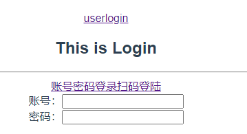

## 考核文档
本次考试可以查询Vue官方文档。
### 知识点包括：  
#### Vue路由(路由的简单使用、路由重定向、嵌套路由、动态路由匹配、编程式导航、命名路由)
- html和css都已给定 请自行创建项目 请勿勾选VueRouter配置

 [1] 路由的简单使用   
- 自行配置好路由
- 实现简单的路由

 [2] 命名路由  
 - 实现命名路由 （在创建Router 实例的时候，通过在routes配置中给某个路由设置名称，从而方便的调用路由。）  
 - 所有路由使用命名路由来调用路由   

 [3] 路由重定向  
 - 实现路由重定向(路径为'/'时 跳转到'/user'页面)  

 [4] 嵌套路由  
 - 实现嵌套路由：  
 - 登入页面('/login')中的两个按钮分别点击出现扫码登录与密码登录  

 [5] 动态路由配置  
 - 实现动态路由配置 
 - 密码登录点击登录按钮后 跳转至 根据输入的邮箱跳转至用户个人空间  
 - 用户个人空间的标题显示 输入的邮箱 (例如: 这是123456@qq.com的个人空间)  

 [6] 编程式导航  
 - 实现编程式导航   
 - 点击页面中的前进一步 与 后退一步 可进行返回或者前进历史页面  

------------------------------------------------------------User组件演示--------------------------------------------------------------------

-----------------------------------------------------------Login组件演示--------------------------------------------------------------------  

#### Vuex(state的使用、mutation的使用、cation的使用、getter的使用)
- html和css都已给定 请自行创建项目 可以勾选VueX选项

 [1] state的使用    
- 数据： {name:'张三' , age:18 , like:'rua'}  
- 在页面中显示数据内容    

 [2] mutation的使用    
- 数据： {const:0}   
- 渲染数据后 页面点击按钮 实现const数据的++     

 [3] action的使用  
- 数据： {num:0}    
- 渲染num数据后 页面点击按钮 实现num数据的每秒+1  

 [4] getter的使用    
- 数据： {const：0}  
- 使用getter绑定Store 中已有的数据 进行渲染  