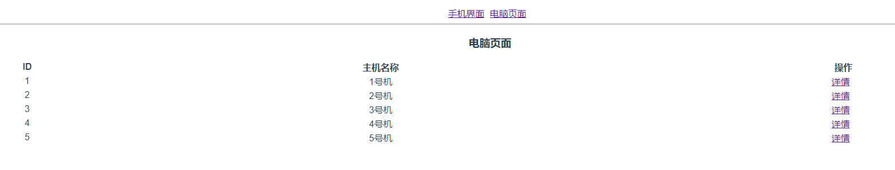
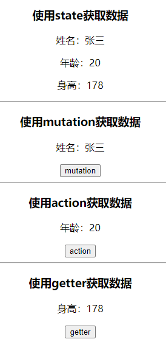

### Vue路由(路由的简单使用、路由重定向、嵌套路由、动态路由匹配、编程式导航、命名路由) 

页面：
/phone 手机页面
	/huawei 华为手机
	/xiaomi 小米手机
/computer 电脑页面
	/details 电脑详情

页面上下结构,上面为导航列表(home,phone,computer),下面显示导航对应的内容页面

1.手动搭建路由【路由的简单使用】
2.打开页面"/"时内容页面显示“/phone”页面【路由重定向】
3."/phone"页面里面有"/huawei"和"/xiaomi"两个标签【嵌套路由】
4."/phone"页面的链接使用命名路由的方式进行跳转【命名路由】
5."/computer"页面下有5个型号的电脑列表(每个型号有独立的ID),每个型号电脑有"详情"链接可以进入"/details"页面并展示电脑对应的ID【动态路由匹配】
6."/details"页面下有返回链接,可返回到上一个页面【编程式导航】

/computer页面数据：

```js
list: [
	{
        id: 1,
        name: "1号机"
    },
    {
        id: 2,
        name: "2号机"
    },
    {
        id: 3,
        name: "3号机"
    },
    {
        id: 4,
        name: "4号机"
    },
    {
        id: 5,
        name: "5号机"
    }
]
```

页面截图：

/phone 手机页面


/computer 电脑页面



/huawei 华为手机


/details 电脑详情


### Vuex(考核 state的使用、mutation的使用、action的使用、getter的使用)

创建项目时可勾选vuex

```js
数据:  name:'张三' , age:18 , height:178

1.打开页面自动使用state方法渲染出 姓名、年龄、身高
2.点击mutation按钮使用mutation方法渲染出 姓名
3.点击action按钮使用action方法渲染出 年龄
4.点击state按钮使用state方法渲染出 身高
```

