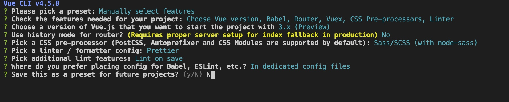

# happy anwser

## 项目初始化

```shell
  vue create happy-answer
```



## 项目准备工作

### 删除内容

1.删除掉Vue-CLI创建的views文件夹
2.删除掉components中的HelloWorld.vue文件
3.删除router文件夹index.js的2-19行代码
4.删除App.vue中的第2-6行代码
5.删除App.vue中的第14-25行代码

### 外部资源

**public放别人家js文件（也就是不会变动），assets放自己写的js文件（需要改动的文件）**
1.在public中添加data文件夹，在其中放置quesition.json
2.在public中添加css文件夹，在其中放置common.scss
3.在public中添加image文件夹，在其中放置项目用到的图片
4.在public中添加js文件夹，在其中放置rem.js

## 项目功能

### 显示首页

#### 创建组件

1.在components中创建Home文件夹,在该文件夹下创建index.vue

```vue
<template>
  <div class="home_container">
    <section>
      <!-- 头部标签 -->
      <header class="top_tips">
        <span class="num_tip">{{ level }}</span>
      </header>
      <!-- 首页内容 -->
      <div>
        <div class="home_logo item_container_style"></div>
        <router-link to="/item" class="start button_style"></router-link>
      </div>
    </section>
  </div>
</template>

<script>
import { mapState } from "vuex";
export default {
  computed: {
    ...mapState(["level"])
  }
};
</script>

<style lang="scss">
.top_tips {
  position: absolute;
  height: 7.35rem;
  width: 3.25rem;
  top: -1.3rem;
  right: 1.6rem;
  background: url("/images/WechatIMG2.png") no-repeat;
  background-size: 100% 100%;
  z-index: 10;
  .num_tip {
    position: absolute;
    left: 0.48rem;
    bottom: 1.1rem;
    height: 0.7rem;
    width: 2.5rem;
    font-size: 0.6rem;
    font-family: "黑体";
    font-weight: 600;
    color: #a57c50;
    text-align: center;
  }
}

.item_container_style {
  height: 11.625rem;
  width: 13.15rem;
  background-repeat: no-repeat;
  position: absolute;
  top: 4.1rem;
  left: 1rem;
}
.home_logo {
  background-image: url("/images/1-2.png");
  background-size: 13.142rem 100%;
  background-position: right center;
}

.button_style {
  display: block;
  height: 2.1rem;
  width: 4.35rem;
  background-size: 100% 100%;
  position: absolute;
  top: 16.5rem;
  left: 50%;
  margin-left: -2.4rem;
  background-repeat: no-repeat;
}
.start {
  background-image: url("/images/1-4.png");
}
</style>


```

#### 设置路由

2.在router文件夹index.js中引入Home组件

```js
import Home from "@/components/Home"
```

3.在router文件夹index.js中

```js
let routes = [{
  // 当用户进入页面加载Home组件
    {
    path: "/",
    component: Home
  }
}];
```

4.在src中的App.vue中

```html
<template>
  <router-view />
</template>
```

#### 请求数据

1.在store文件夹中index.js

```js
import { createStore } from "vuex";
import axios from "axios";
export default createStore({
  state() {
    return {
      // 活动周数
      level: "第一周"
    };
  },
});

```

### 显示题目

#### 初始化数据

##### 1.在store的state中定义数据

```js
 state() {
    return {
      // 活动周数
      level: "第一周",
      // 第几题
      itemNum: 1,
      // 总共用时
      allTime: 0,
      // 答案
      answerid: [],
      questions: []
    };
  },
```

##### 2.在actions中定义getData方法获取问题(question.json)

```js
 // 获取数据
    async getData(context) {
      let res = await axios.get("/data/question.json");
      context.commit("initData", res);
    },
```

##### 3.把值传给mutations中的initData方法,给state中的questions数组赋值

```js
 // 初始化数据
    initData(state, payload) {
      // console.log(payload);
      state.questions = payload.data;
    }
```

##### 4.映射action方法到组件

```js
import { mapActions } from "vuex";
```

##### 5.在created方法中调用

```js
  created() {
    this.$store.dispatch("getData");
  },
```

#### 渲染题目页面头部

##### 1.映射state数据到组件

```js
import { mapState, mapActions } from "vuex";
```

##### 2.书写模板

```html
 <!-- 头部标签 -->
  <header class="top_tips">
    <span class="num_tip">题目{{ itemNum }}</span>
  </header>
```

##### 3.复制样式到item组件(根据自己的情况 去找)

```scss
<style lang="scss">
.next_item {
  background-image: url("/images/2-2.png");
}

.submit_item {
  background-image: url("/images/3-1.png");
}

.item_back {
  background-image: url("/images/2-1.png");
  background-size: 100% 100%;
}

.item_title {
  font-size: 0.65rem;
  color: #fff;
  line-height: 0.7rem;
}

.item_list_container {
  margin: 2.5rem;
  padding: 0;
}

.item_list {
  font-size: 0;
  margin-top: 0.4rem;
  width: 10rem;
  span {
    display: inline-block;
    font-size: 0.6rem;
    color: #fff;
    vertical-align: middle;
  }
  .option_style {
    height: 0.725rem;
    width: 0.725rem;
    border: 1px solid #fff;
    border-radius: 50%;
    line-height: 0.725rem;
    text-align: center;
    margin-right: 0.3rem;
    font-size: 0.5rem;
    font-family: "Arial";
  }
  .has_choosed {
    background-color: #ffd400;
    color: #575757;
    border-color: #ffd400;
  }
  .option_detail {
    width: 7.5rem;
    padding-top: 0.11rem;
  }
}
</style>

```

##### 4.在computed中把itemNum映射到mapState中

```js
   ...mapState(["itemNum"]),
```

#### 渲染题目页面内容区域(题干)

##### 1.复制模板到头部下面

```html
<div class="item_back item_container_style">
    <div class="item_list_container" >
      <!-- 题干 -->
      <header class="item_title">我是题干</header>
      <!-- 选项 -->
      <ul>
        <li class="item_list">
          <span class="option_style">A</span>
          <span class="option_detail">答案a</span>
        </li>
        <li class="item_list">
          <span class="option_style">B</span>
          <span class="option_detail">答案b</span>
        </li>
        <li class="item_list">
          <span class="option_style">C</span>
          <span class="option_detail">答案c</span>
        </li>
        <li class="item_list">
          <span class="option_style">D</span>
          <span class="option_detail">答案d</span>
        </li>
      </ul>
    </div>
  </div>
```

##### 2.把questions数组映射到computed中

```js
  computed: {
    ...mapState(["questions"])
  }
```

##### 3.通过computed属性获取题干

```js
 itemTitle() {
      return this.questions[this.itemNum - 1].topic_name;
    }
```

##### 4.把itemTitle放到题干中

```html
  <header class="item_title">{{ itemTitle }}</header>
```

#### 渲染题目页面内容区域(选项)

##### 1.渲染每个选项

1.1 v-for
1.2 key

```html
<!-- 选项 -->
<ul>
  <li class="item_list" v-for="(item) in questions[itemNum - topic_answer" :key="item.topic_answer_id">
    <span class="option_style">A</span>
    <span class="option_detail">{{item.answer_name}}</span>
  </li>
</ul>
```

##### 2.让索引变成A B C D选项

```js
chooseType: type => {
      switch (type) {
        case 0:
          return "A";
        case 1:
          return "B";
        case 2:
          return "C";
        case 3:
          return "D";
      }
    },
```

```html
<span class="option_style">{{chooseType(index)}}</span>

或者:

 <span class="option_style">{{String.fromCharCode(65+index)}}</span>
```

##### 3.点击某一一个Li，被选中

###### 3.1 在data中定义chooseNum代表答案索引，chooseId代表答案id

```js
data() {
    return {
      chooseNum: null, //  选中答案索引
      chooseId: null // 选中答案id
    };
  },
```

###### 3.2 把这一项的索引和topic_answer_id传递给方法

```html
  @click="choosed(index,item.topic_answer_id)"
```

###### 3.3 在data中存储选中答案的索引和答案id

```js
 choosed(type, id) {
      this.chooseNum = type;
      this.chooseId = id;
    },
```

###### 3.4 在模板中判断,如果选中的chooseNum和某一项的索引一样，就给选项字母添加 has_choosed

```html
  <span class="option_style" :class="{'has_choosed': chooseNum == index}">{{chooseType(index)}}</span>
```

#### 点击下一个题目

##### 1.在内容区域下面添加两个按钮

```html
<span class="next_item button_style" ></span>
<span class="submit_item button_style" ></span>
```

##### 2.如果题目的数字不大于题目数组的最大长度，那么显示下一题否则显示提交

```html
 <span class="next_item button_style" v-if="itemNum < questions.length"></span>
  <span class="submit_item button_style" v-else ></span>
```

##### 3.点击下一题按钮,判断用户是否选择了答案，如果选择了那么把选择的答案id保存 否则提示用户"您还没有选择答案"

```js
 nextItem() {
      if (this.chooseNum != null) {
        this.chooseNum = null;
        // 保存答案，题目索引加一，跳到下一题
      } else {
        alert("您还没有选择答案哦");
      }
    }
```

##### 4.把选择的答案id传给addNum方法

```js
 nextItem() {
      if (this.chooseNum != null) {
        this.chooseNum = null;
        // 保存答案，题目索引加一，跳到下一题
         this.addNum(this.chooseId);
      } else {
        alert("您还没有选择答案哦");
      }
    }
```

##### 5.在store的action中定义addNum方法,把选择的id保存在answerid数组中

```js
  addNum(context, id) {
      // 点击下一题, 记录答案id, 判断是否是最后一题, 如果不是则跳转到下一题
      context.commit("remberAnswer", id);
    }
```

##### 6.在mutations中定义AddItemNum方法

```js
  // 点击进入下一题
    addItemNum(state, num) {
      // console.log(num);
      state.itemNum += num;
    },
```

##### 7.在mutations中定义remberAnswer方法

```js
 // 记录答案
    remberAnswer(state, id) {
      state.answerid.push(id);
    },
```

##### 8.如果itemNum的大小小于question的长度那么让ItemNum加1

```js
  addNum(context, id) {
      // 点击下一题, 记录答案id, 判断是否是最后一题, 如果不是则跳转到下一题
      context.commit("remberAnswer", id);
      // 如果itemNum小于题目的数量那么调用addItemNum
      if (context.state.itemNum < context.state.questions.length) {
        context.commit("addItemNum", 1);
      }
    }
```

### 显示分数

#### 0.复制样式

```scss
<style lang="scss" scoped>
#app {
  background-image: url("/images/4-1.jpg");
  padding-top: 1.2rem;
}
.your_scores_container {
  width: 9.7rem;
  height: 9.1rem;
  background: url("/images/4-2.png") no-repeat;
  background-size: 100% 100%;
  margin: 0 auto 0;
  position: relative;
  .your_scores {
    position: absolute;
    width: 100%;
    text-indent: 3.3rem;
    top: 4.7rem;
    font-size: 1.4rem;
    font-weight: 900;
    -webkit-text-stroke: 0.05rem #412318;
    font-family: "Microsoft YaHei";
    .score_num {
      font-family: Tahoma, Helvetica, Arial;
      color: #a51d31;
    }
    .fenshu {
      color: #a51d31;
    }
  }
  .result_tip {
    position: absolute;
    top: 7rem;
    width: 9rem;
    left: 0.6rem;
    color: #3e2415;
    font-size: 0.65rem;
    text-align: center;
  }
}
.share_button {
  width: 6.025rem;
  height: 2.4rem;
  margin: 0.8rem auto 0;
  background: url("/images/4-3.png") no-repeat 0.4rem 0;
  background-size: 5.825rem 100%;
}
.share_code {
  width: 5.3rem;
  margin: 1.5rem auto 0;
  .share_header {
    color: #664718;
    font-size: 0.475rem;
    font-family: "Microsoft YaHei";
    width: 7rem;
    font-weight: 500;
  }
  .code_img {
    height: 5.3rem;
    width: 5.3rem;
    margin-top: 0.5rem;
  }
}
.share_cover {
  position: fixed;
  bottom: 0;
  right: 0;
  top: 0;
  left: 0;
  background: url("/images/5-1.png") no-repeat;
  background-size: 100% 100%;
  opacity: 0.92;
}
.share_img {
  height: 10.975rem;
  width: 11.95rem;
  position: fixed;
  top: 0.5rem;
  left: 50%;
  margin-left: -5.975rem;
}
</style>

```

#### 1.显示分数和对应的提示信息

##### 1.1 复制模板

```html
  <div class="your_scores_container">
      <header class="your_scores">
        <span class="score_num">{{score}}</span>
        <span class="fenshu">分!</span>
      </header>
      <div class="result_tip" >{{scoreTips}}</div>
    </div>
```

##### 1.2 在data中定义数据

```js
   data() {
    return {
      showHide: false, //是否显示提示
      score: 0, //分数
      scoreTips: "", //分数提示
      rightAnswer: [2, 7, 12, 13, 18], //正确答案
      scoreTipsArr: [
        "你说，是不是把知识都还给小学老师了？",
        "还不错，但还需要继续加油哦！",
        "不要嘚瑟还有进步的空间！",
        "智商离爆表只差一步了！",
        "你也太聪明啦，葡萄之家欢迎你！"
      ]
    };
  },
```

##### 1.3 映射anwserId数组

```js
import {mapState} from "vuex"

computed: mapState(["anwserId"]),
```

##### 1.4 计算分数

```js
   computedScore(){
      // console.log(this.anwserId)
      this.anwserId.forEach((item,index)=>{
        if (item == this.rightAnswer[index]){
          this.score += 20;
        }
      })
    }
```

##### 1.5 根据分数显示

```js
 // 根据分数显示
    getScoreTip: function() {
      if (this.score <= 20) {
        this.scoreTips = this.scoreTipsArr[0];
        return;
      }
      if (this.score <= 40) {
        this.scoreTips = this.scoreTipsArr[1];
        return;
      }
      if (this.score <= 60) {
        this.scoreTips = this.scoreTipsArr[2];
        return;
      }
      if (this.score <= 80) {
        this.scoreTips = this.scoreTipsArr[3];
        return;
      }
      if (this.score <= 100) {
        this.scoreTips = this.scoreTipsArr[4];
      }
    },
```

#### 2.点击分享按钮 显示遮罩 点击遮罩 隐藏自己

##### 2.1 复制模板

```html
  <div class="share_button" @click="showCover"></div>

  <div class="share_code">
    <header class="share_header">关注葡萄之家,获取答案.</header>
    
  </div>

 <div class="share_cover" v-show="showHide" @click="showCover" >
    
  </div>
```

##### 2.2 点击按钮 控制遮罩的显示和隐藏

```js
  showCover(){
       this.showHide = !this.showHide;
    }
```
