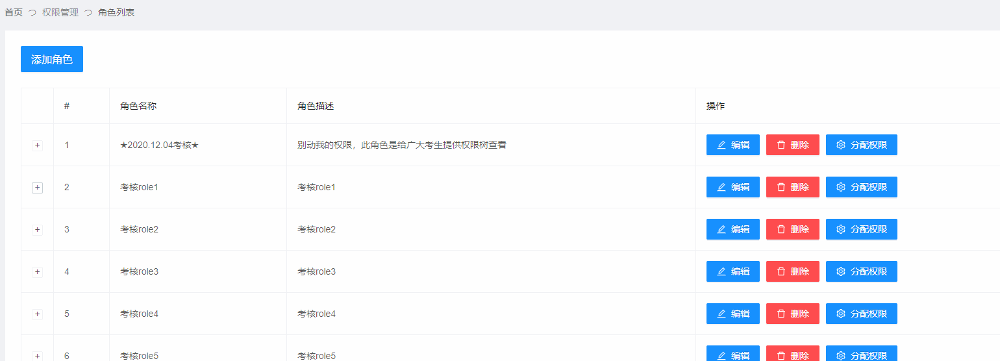
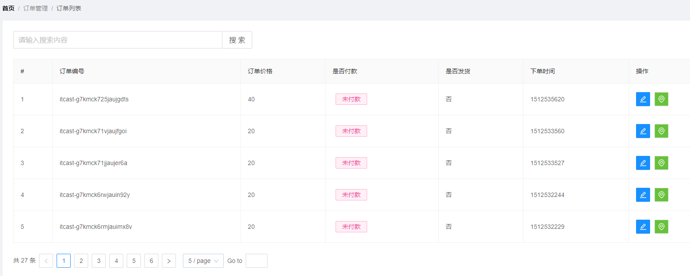
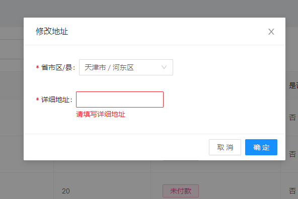
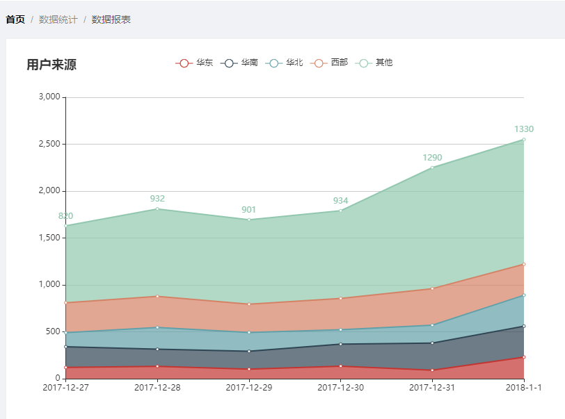
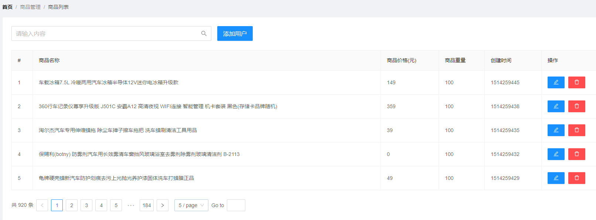
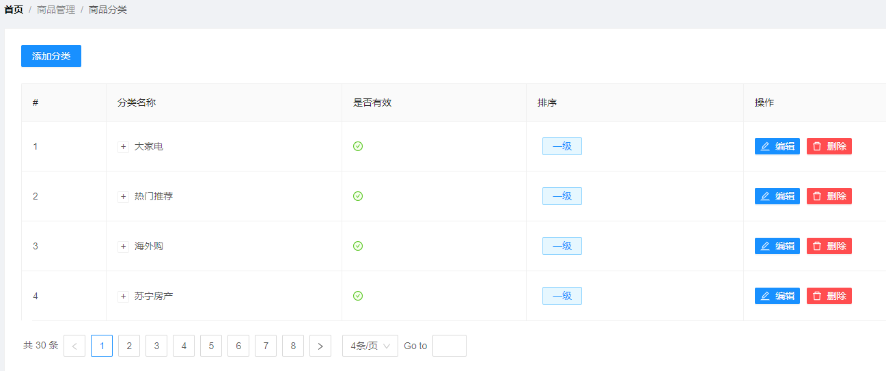
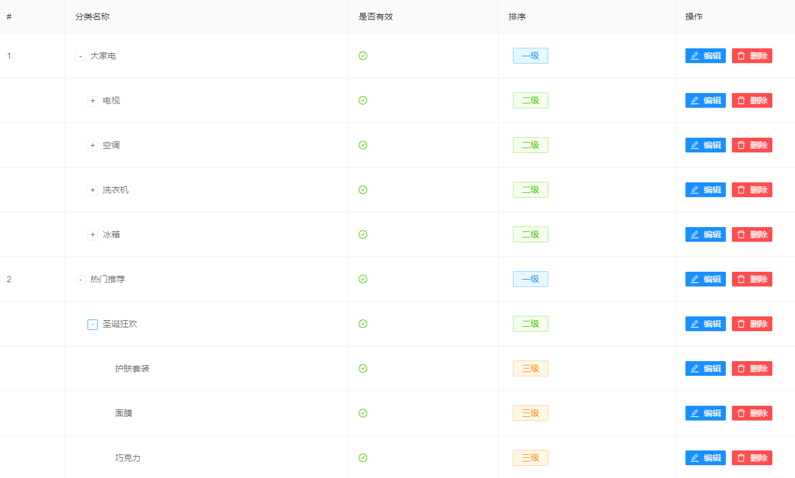

## 考核题

`要求：完成电商后台管理系统的角色列表(权限方面)、订单列表、数据报表、商品管理(商品列表、商品分类)等。`


### 一、考核相关提供

#### 1、文档网址

UI框架文档：https://2x.antdv.com/docs/vue/introduce-cn

Echarts官网：https://echarts.apache.org/zh/index.html


#### 2、图标icon

`如有纰漏or不想要，请自行查找✔`

```js
编辑: EditOutlined
删除: DeleteOutlined
设置: SettingOutlined
警告: ExclamationCircleOutlined
水滴: EnvironmentOutlined
双色风格的✔: CheckCircleTwoTone
双色风格的✘: CloseCircleTwoTone
```

#### 3、校验规则

- ###### 省市地址

  ```js
  1.必填，(错误提示:"请选择省市地址")
  ```
  
- ###### 详细地址

  ```js
  1.必填，(错误提示:"请填写详细地址"
  ```

#### 4、效果图参考

- ##### `角色列表页`

  

- ##### `订单管理页`

  

  

- ##### `数据报表页`

  

- ##### `商品列表页`

  

- ##### `商品分类页`

  

  

### 二、考核需求

- ##### 角色列表页

  - ###### 展开权限中的移除权限

  - ###### 分配权限树查看 (`无需实现分配权限`)

- ##### 订单列表页

  - ###### 布局

  - ###### 分页

  - ###### 修改地址 `模拟`

- ##### 数据报表页

  - ###### 布局 + `Echarts绘图`


- ##### 商品列表页

  - ###### 布局

  - ###### 分页

- ##### 商品分类页

  - ###### 布局 + 展开

  - ###### 分页


##### 问题咨询

如有疑问：`立即咨询 ` ~~`110`~~ `学委`


