## 考核题

`要求：完成电商后台管理系统的分配权限、商品列表、商品添加、分类参数等。`


### 一、考核相关提供

#### 1、文档网址

UI框架文档：https://2x.antdv.com/docs/vue/introduce-cn

解决[分配权限]：https://www.jianshu.com/p/a293d1589c24

富文本编辑器：https://www.cnblogs.com/miaosen/p/10912538.html


#### 2、图标icon

`如有纰漏or不想要，请自行查找✔`

```js
编辑: EditOutlined
删除: DeleteOutlined
设置: SettingOutlined
警告: ExclamationCircleOutlined
下载: UploadOutlined
加号: PlusOutlined
```

#### 3、校验规则

- ###### 添加商品-基本信息	

  ```js
  1.商品名称 [必填] (错误提示:"商品名称不能为空")
  2.商品价格 [必填] (错误提示:"商品价格不能为空")
  3.商品重量 [必填] (错误提示:"商品重量不能为空")
  4.商品数量 [必填] (错误提示:"商品数量不能为空")
  5.商品分类 [必填] (错误提示:"商品分类不能为空")
  ```
  
- ###### 填写商品参数/属性

  ```js
  1.动态参数 [必填] (错误提示:"参数/属性名不能为空")
  2.静态属性 [必填] (错误提示:"参数/属性名不能为空")
  ```

#### 4、上传图片提供

- ##### `可直接对着图片右键复制到本地`


#### 5、效果图参考

- ##### `分配权限功能`

  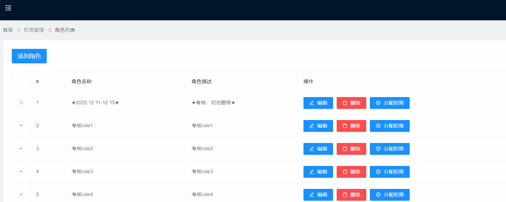

- ##### `删除商品功能`

  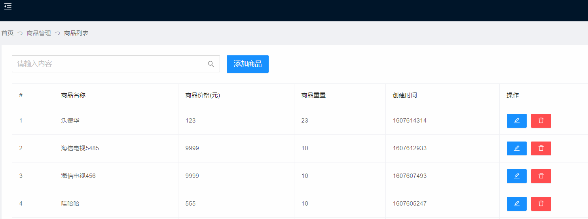

- ##### `商品添加页`

  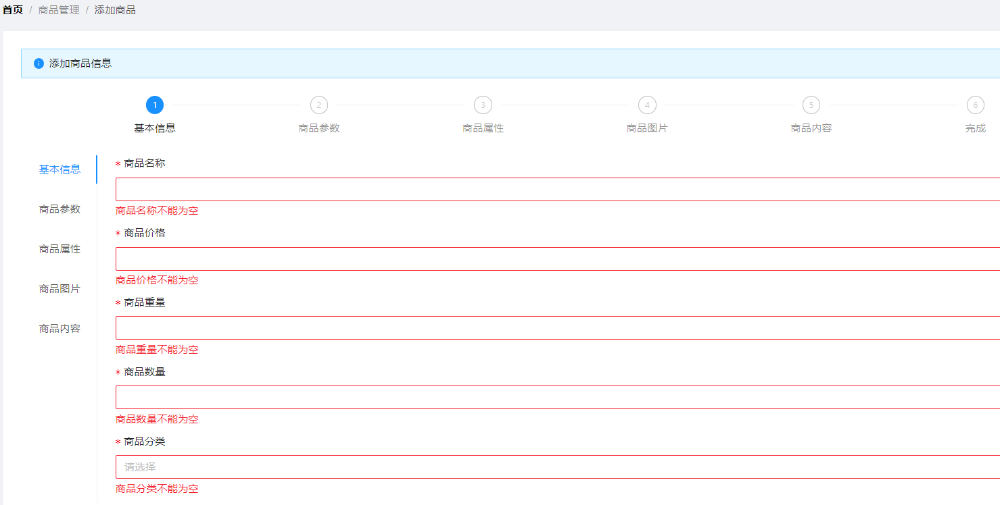

  

  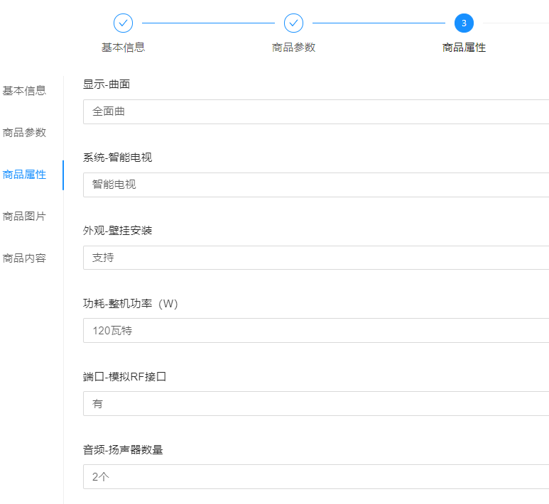

  

  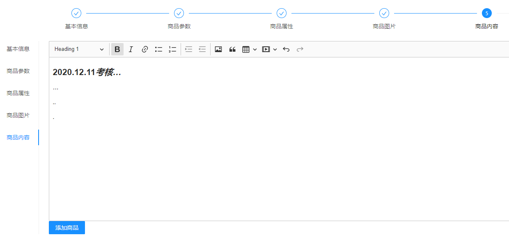

  - ###### `商品添加功能`

    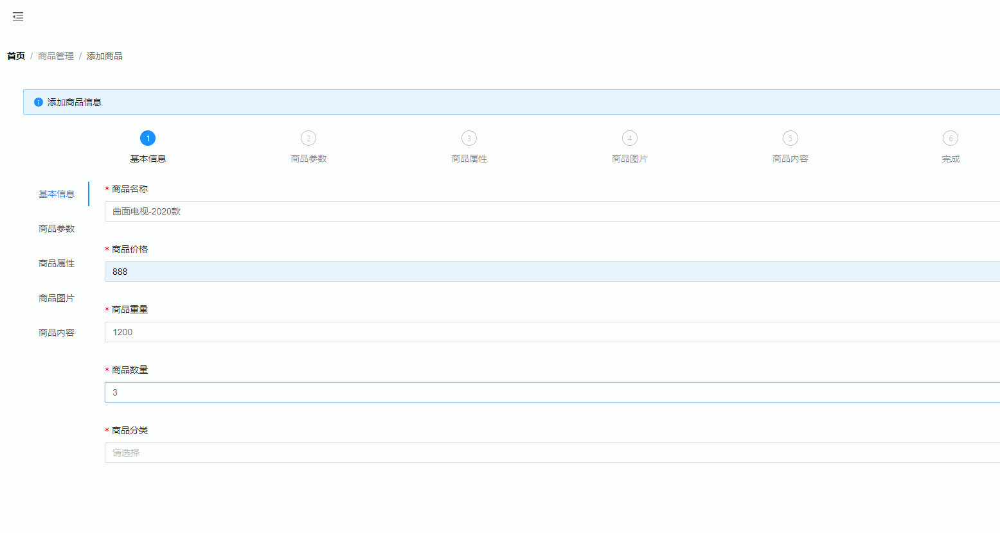

- ##### `分类参数页`

  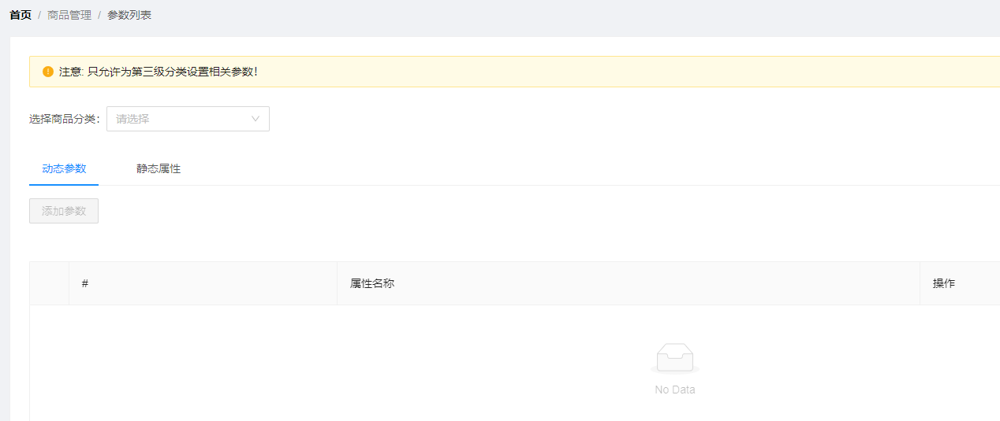

  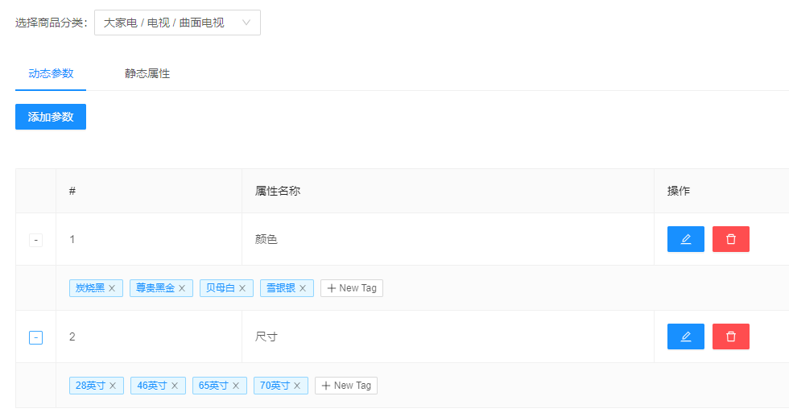

  - ###### `分类参数 添加功能`

    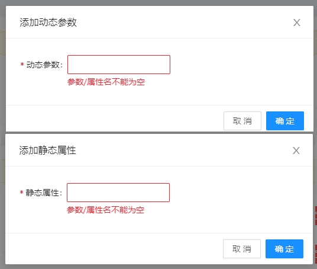

    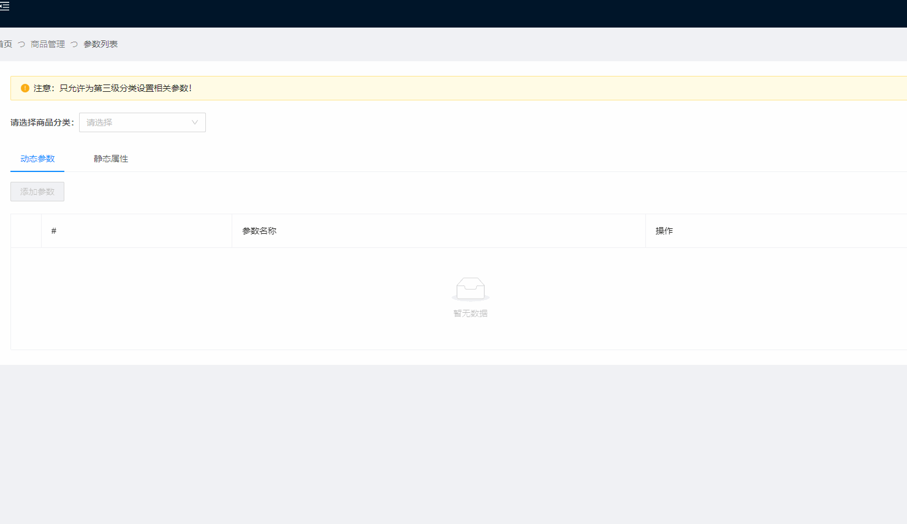

  - ###### `分类参数 +NewTab功能`

    

  - ###### `分类参数 tag删除功能`

    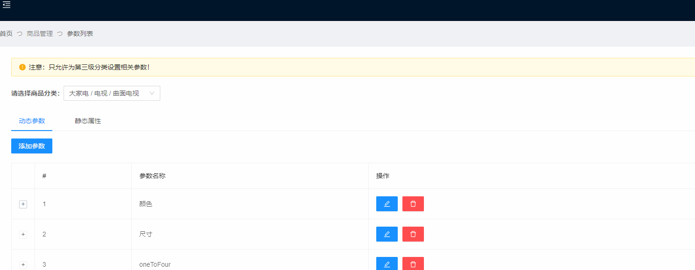

  - ###### `分类参数 删除功能`

    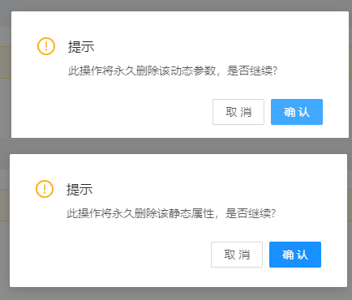

    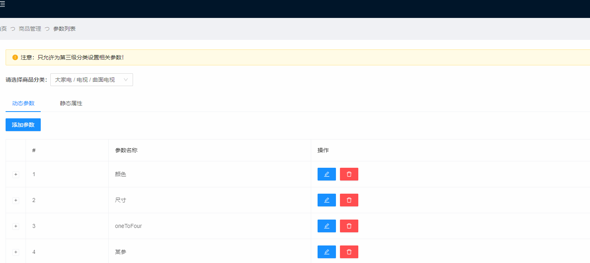

  - ###### `分类参数 修改功能`

    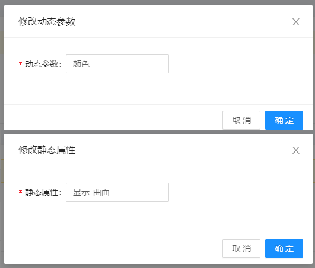

    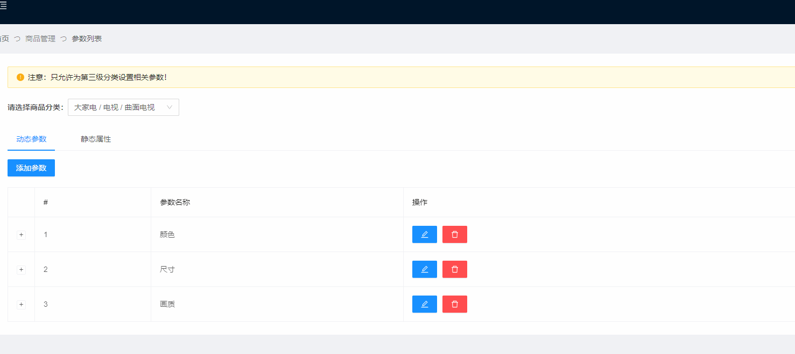

  

### 二、考核需求

- ##### 角色列表

  - ###### 分配权限功能

    1. 任意勾选权限，点击确定可实现权限分配
    2. 不勾选权限，直接点击确定无任何影响

- ##### 商品列表

  - ###### 删除商品功能

- ##### 商品添加

  - ###### 布局 + 添加功能

  - ###### 添加-基本信息

  - ###### 添加-商品参数

  - ###### 添加-商品属性

  - ###### 添加-商品图片

  - ###### 添加-商品内容

- ##### 分类参数

  - ###### 布局 + 增删改查

  - ###### 动态参数/静态属性 添加功能

  - ###### 动态参数/静态属性下的Tag +NewTag功能

  - ###### 动态参数/静态属性下的Tag 删除功能

  - ###### 动态参数/静态属性 删除功能

  - ###### 动态参数/静态属性 修改功能


##### 问题咨询

如有疑问：`立即咨询 ` ~~`110`~~ `学委`


